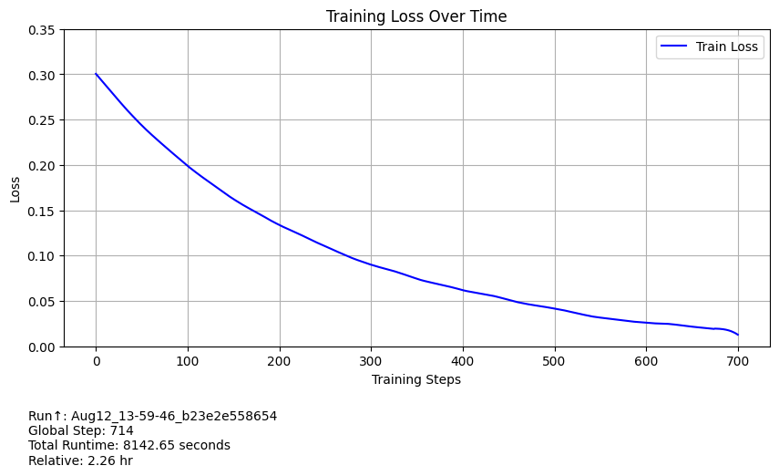
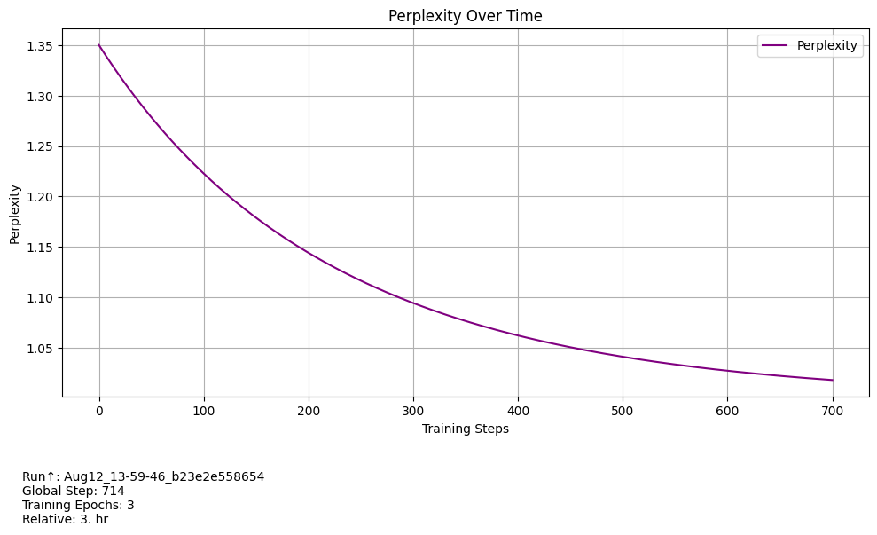
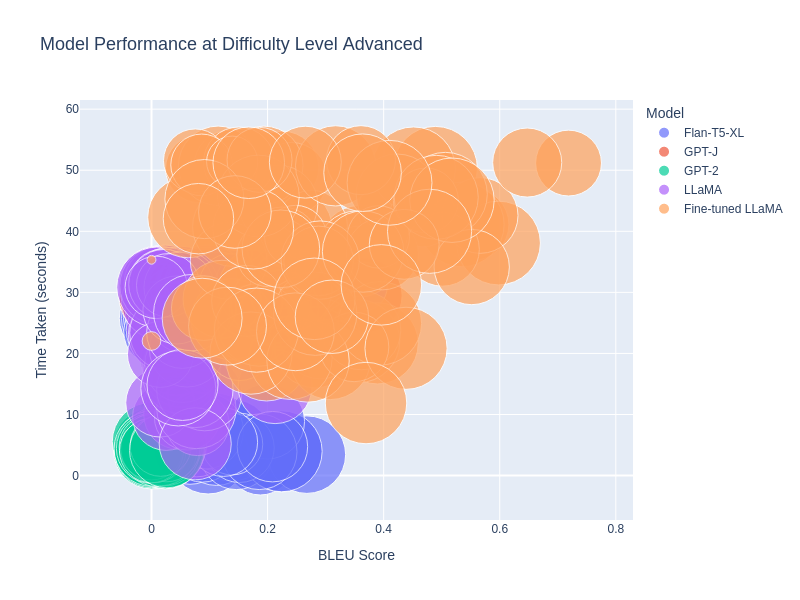
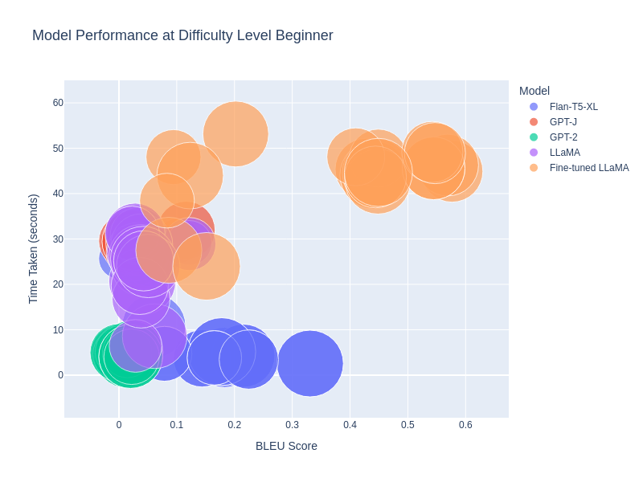
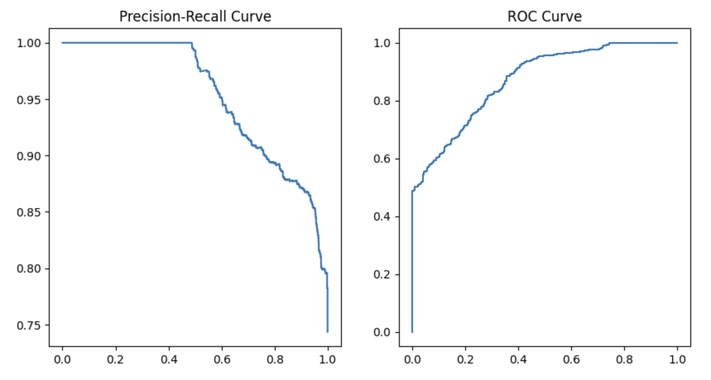
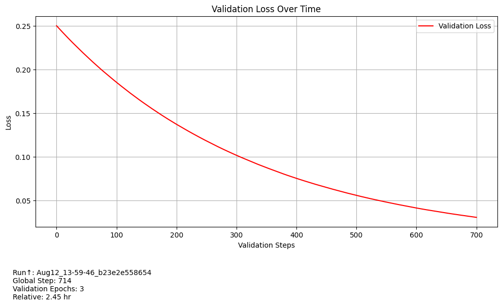

# Evaluating Large Language Models (LLMs) on Statistical Problem Solving

This repository contains datasets, evaluation results, fine-tuning notebooks, and statistical analysis tools used in the dissertation **"Evaluating the Performance of Large Language Models on Statistical Problem Solving"** by Crish Nagarkar, submitted to the University of Leeds.

## Overview

The research aims to evaluate the capacity of large language models (LLMs) like GPT-2, GPT-J, FLAN-T5, and LLaMA to solve complex statistical reasoning tasks. It focuses on improving model performance through fine-tuning techniques like **Low-Rank Adaptation (LoRA)** and **8-bit quantization**. These models are tested on a custom dataset designed to measure their ability in statistical concepts, such as hypothesis testing, regression analysis, and ANOVA.

---

## Contents

### 1. Notebooks
- `fine_tuned_evaluation.ipynb`: Fine-tuning and evaluation of LLaMA on statistical reasoning tasks.
- `gpt_2_evaluation.ipynb`: Baseline evaluation of GPT-2.
- `gpt_j_evaluation.ipynb`: GPT-J’s performance on advanced statistical tasks.
- `llama_evaluation_final.ipynb`: Pre-fine-tuning evaluation of LLaMA.
- `flan.ipynb`: Evaluation of FLAN-T5 on statistical reasoning tasks.

### 2. Datasets
- `cognitive_process_dimension_analysis.csv`: Performance of models across cognitive processes.
- `model_behavior_analysis.csv`: Statistical analysis of model behavior.
- `multi_modal_interpretation.csv`: Multi-modal reasoning dataset.
- `statistical_reasoning_process_decomposition.csv`: Decomposition of statistical reasoning tasks.

### 3. Evaluation Results
- `flan_t5_xl_results.json`: FLAN-T5 performance metrics.
- `gpt_j_results.json`: GPT-J performance metrics.
- `gpt2_results_with_metrics.json`: GPT-2 performance metrics.
- `llama_finetuned_results.json`: Fine-tuned LLaMA metrics.
- `llama_results.json`: LLaMA evaluation results.

---

## Methodology

### Dataset Preparation

The dataset focuses on three difficulty levels: **Basic**, **Intermediate**, and **Advanced**, covering statistical concepts such as hypothesis testing, regression, and ANOVA. The dataset is designed to balance computational problem-solving with logical reasoning.

### Fine-Tuning Techniques

Fine-tuning was done using **Low-Rank Adaptation (LoRA)** and **8-bit quantization**, which significantly reduced memory usage while maintaining model performance, enabling fine-tuning on GPUs with limited resources.

---

## Performance Metrics

Model performance was evaluated using both NLP metrics (BLEU scores, perplexity) and domain-specific metrics like hypothesis accuracy and regression accuracy. **Embedding similarity** scores were also used to assess the models’ ability to understand statistical relationships.

---

### Loss and Perplexity Over Time

Both training loss and perplexity decreased over time during the fine-tuning of LLaMA, as shown below:

  
*Fig 3: Training loss during fine-tuning.*

  
*Fig 4: Perplexity reduction over time.*

---

## Evaluation of Models

Various models were tested on statistical reasoning tasks, with performance visualized through charts:

### Advanced-Level Performance

The bubble chart below shows the performance of each model on advanced statistical tasks. The x-axis represents the BLEU score, while the y-axis shows the time taken, and bubble size indicates tokens processed.

  
*Fig 5: Model performance at advanced difficulty level.*

### Beginner-Level Performance

A similar analysis for beginner-level tasks is shown below:

  
*Fig 6: Model performance at beginner difficulty level.*

---

### ROC and Precision-Recall Curves

For classification tasks, **ROC** and **Precision-Recall** curves were used to measure performance:

  
*Fig 8: ROC and precision-recall curves for classification tasks.*

---

## Validation and Generalization Performance

The validation loss illustrates how well models generalize to unseen data:

  
*Fig 12: Validation loss over time.*

---

## Key Findings

- **Fine-tuned LLaMA** outperformed other models in statistical reasoning tasks, demonstrating the effectiveness of domain-specific fine-tuning.
- **LoRA and 8-bit quantization** significantly reduced memory requirements without sacrificing performance.
- General models like **GPT-2** and **GPT-J** performed well on simple tasks but struggled with advanced statistical reasoning.
- **FLAN-T5** exhibited good generalization but required further fine-tuning for more complex statistical tasks.

---

## How to Use

1. **Clone the repository**:

   ```bash
   git clone https://github.com/your-repo/statistical-llm-evaluation.git
   ```

2. **Install dependencies**:

   ```bash
   pip install -r requirements.txt
   ```

3. **Run Jupyter notebooks** to replicate model evaluations.

---

## Future Work

Further fine-tuning with **prompt engineering** and **multi-task learning** can enhance model performance on complex statistical tasks. Expanding the dataset to include more diverse problems will also help in assessing LLM capabilities in statistical reasoning.
